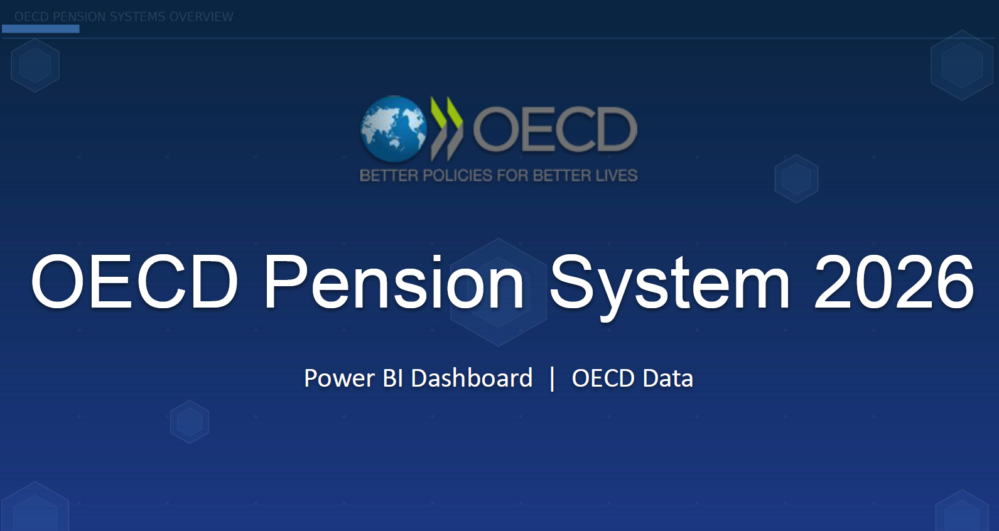
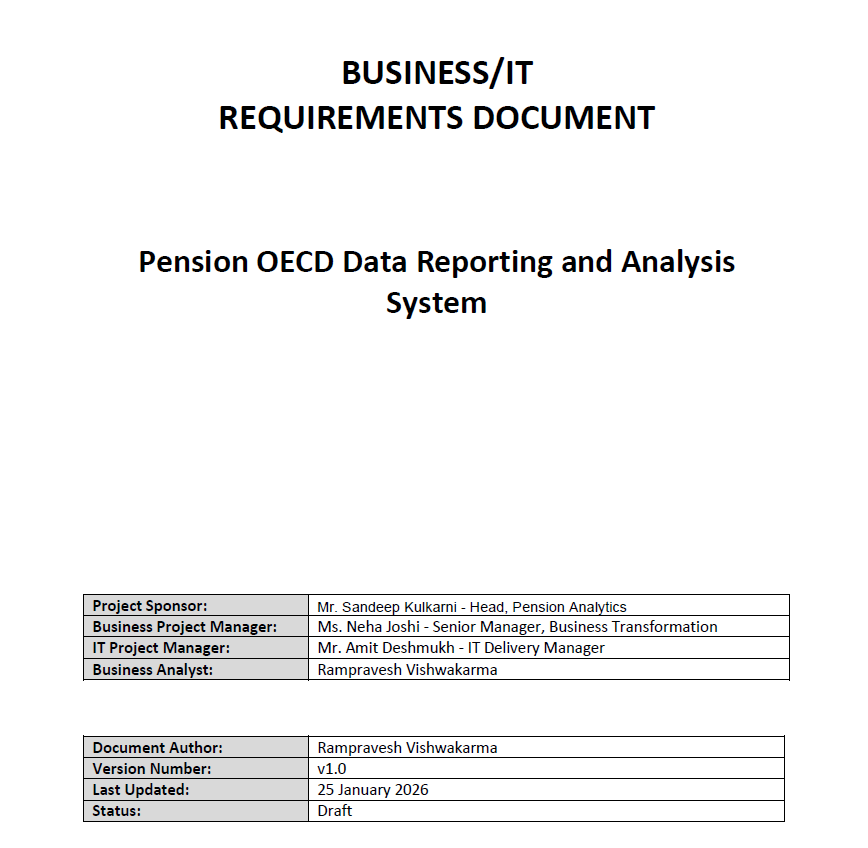
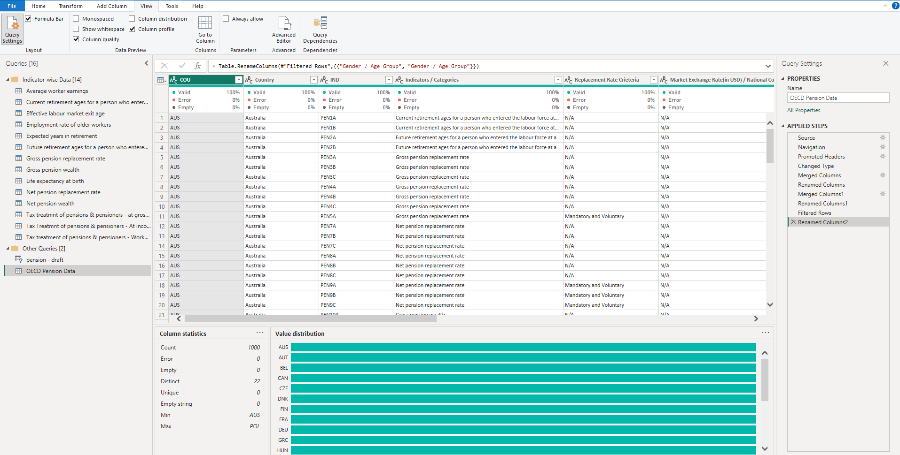
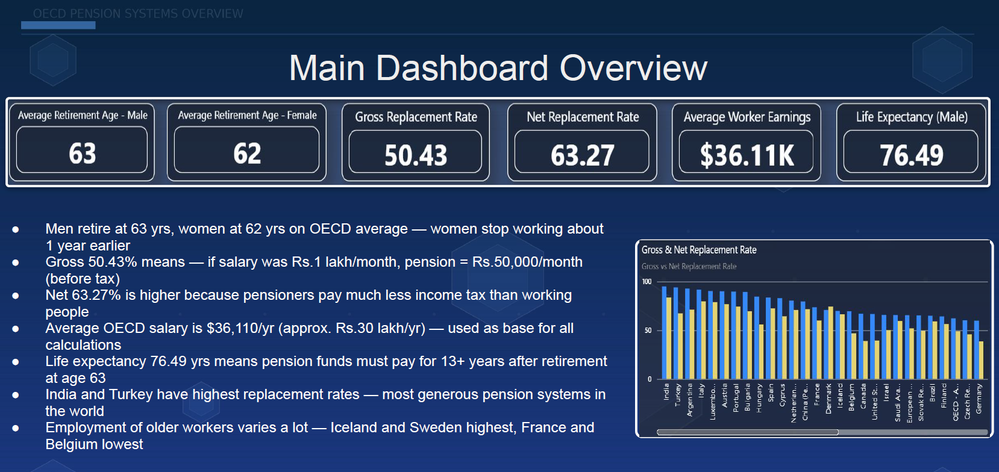
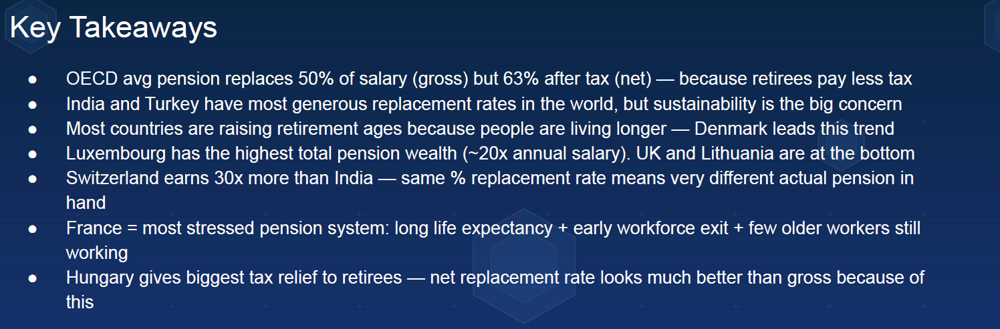

# Pension OECD Data Reporting and Analysis System

## Overview
This project standardizes and analyzes OECD pension data using structured source files, business requirements, and a final reporting output. It demonstrates the end-to-end process from raw data intake to business-ready pension reporting.

## Problem Statement
Raw OECD pension data exists in Excel and CSV formats, but without a formal business baseline, validation rules, and traceability, stakeholders cannot confidently verify how the data becomes a trusted reporting output.

## Objective
- Standardize pension source data.
- Validate and profile key pension fields.
- Create a reporting-ready dataset.
- Build a Power BI dashboard for business insights.
- Document requirements, risks, and controls.

## Tools Used
- Microsoft Excel
- CSV
- Power BI
- Business Requirements Documentation
- Data Validation and Reporting

## Data Source
- OECD pension CSV data.
- OECD pension source workbook.
- Final reference PDF output.

## Key Insights
- The dataset contains 2,279 rows and 17 columns.
- The project covers 51 countries and 14 distinct indicator descriptions.
- Reporting requires data cleansing, mapping, and validation across multiple pension dimensions.
- Governance and traceability are essential for reliable business reporting.

## Recommendations
- Standardize the source-to-target mapping rules.
- Keep a validation checklist for each data refresh cycle.
- Add exception handling and audit logging.
- Maintain version control for both data and dashboard outputs.

## Repository Structure
- `docs/` – BRD and final report.
- `source/` – CSV and Power BI file.
- `assets/` – screenshots and previews.
- `notes/` – summary and assumptions.

## Outcome
This project demonstrates pension-domain business analysis, data validation, reporting design, and dashboard storytelling.

## Screenshots

!

